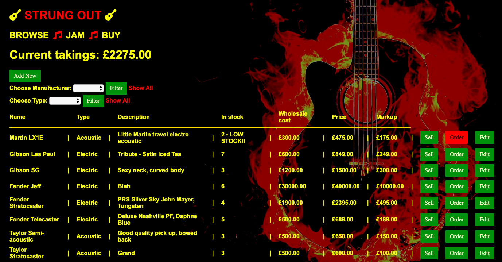

# Strung Out

Strung Out is a shop inventory Ruby application using the Sinatra web framework and a Postgres database.

## Getting Started

These instructions should get you a copy of the project up and running on your local machine for development purposes.

```
createdb guitar_shop
```

Seed the database:

```
ruby db/seeds.rb
```

Run the app:

```
ruby app.rb
```

In your browser, navigate to http://localhost:4567/ and you should see the app's main page.


